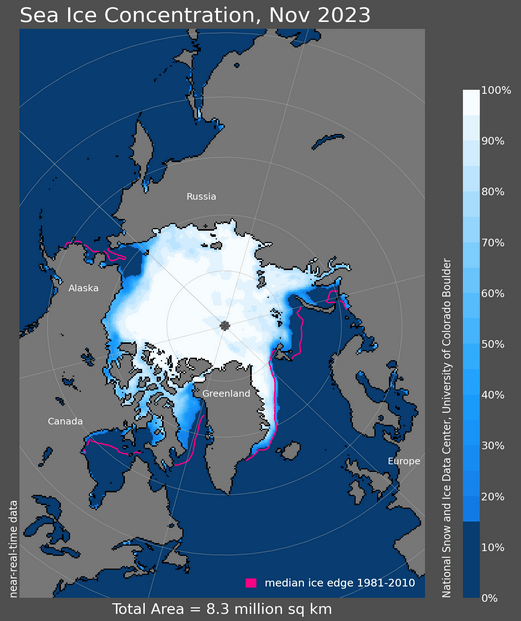

[Sea Ice Index dataset](https://nsidc.org/data/g02135): From here, you can
find associated data access and visualization tools I've also worked on.



:::{.callout-note}
The software for producing Sea Ice Index data is currently closed-source.
:::
