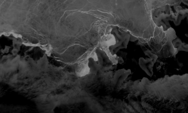

[Images of Antarctic Ice Shelves (NSIDC-0102) v2 dataset](https://nsidc.org/data/nsidc-0102/versions/2):
Images focused on ice shelves considered most susceptible to rapid change due to climate
warming.



:::{.callout-note}
The software for producing and browsing NSIDC-0102v2 data is currently closed-source.
:::
