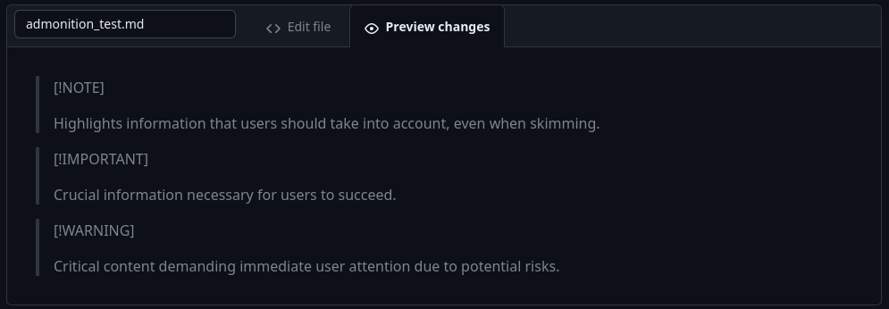
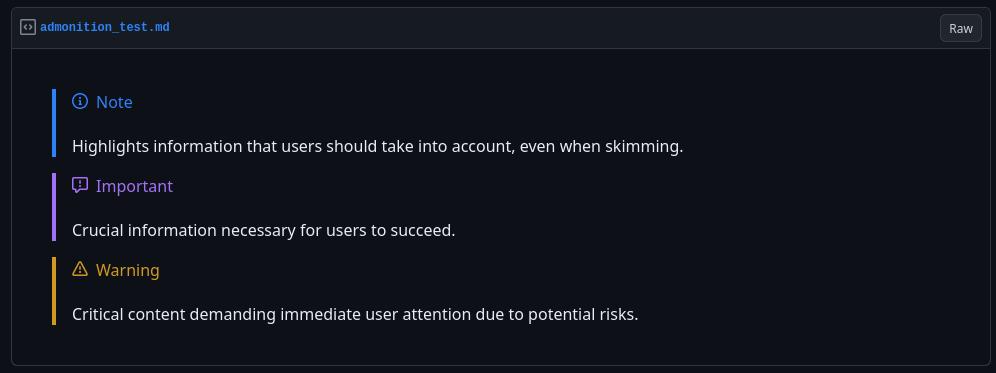

Recently I've learned a few pleasantly-surprising things about GitHub Flavored Markdown
(GFM), and I didn't want to forget these lessons before putting them in to practice.
Blog post time! :sparkles:

While some of these features, like footnotes, are part of Markdown's [Extended
Syntax](https://www.markdownguide.org/extended-syntax/#footnotes), full support in GFM
is new.

These features may not be documented explicitly in the [GFM
specification](https://github.github.com/gfm/), which was last published in 2019 at the
time of this writing.

I will try and update this post as I learn more.


## :foot: Footnotes (2021)

In 2021, GitHub [added footnote
support](https://github.blog/changelog/2021-09-30-footnotes-now-supported-in-markdown-fields/)
to GFM.

Footnotes are commonly used in offline publications to prevent references from
interrupting the flow of prose. While hyperlinks can serve this purpose, sometimes
additional context about a reference can still be disruptive. Try them out in an Issue
or Pull Request!


## :speech_balloon: Admonitions (2022 - Beta)

"Admonitions" or "callouts" enable highlighting various categories of information, like
notes, warnings, and other important text. These are broadly supported in documentation
and publishing tools like Sphinx, MkDocs, and Quarto.

:::{.callout-note}
[Quarto's
callouts](https://quarto.org/docs/authoring/callouts.html) look like this.
:::

This [beta feature](https://www.markdownguide.org/extended-syntax/#footnotes) is still
in flux. It currently is not supported by GitHub's "preview", but on final render, it
looks great.





I'll be using these as often as possible in READMEs, PR and issue descriptions, and
comments. If you found this post by asking me "how did you do that?":

:wave: :heart:


## :magic_wand: Some favorite miscellaneous tricks

These are not new, just some tricks I've been using for a long time to write better
Markdown content.


### GitHub emoji shortcodes

Instead of visiting <emojipedia.org> (or using a browser extension) to search and copy
emojis every time I need them, GitHub has [emoji
shortcodes](https://github.com/hlaueriksson/github-emoji) like Slack does.

Any time you use a shortcode like `:crying_cat_face:`, it will be replaced with an emoji,
like so: :crying_cat_face:.


### Markdown is a superset of HTML!

Any time you need something Markdown doesn't support, you can
fall back to HTML. This enables centering images or text as well as the next trick,
which is one of my favorites:


### Collapsible text

You can collapse large text blocks, e.g. logs, with a `<details>` tag, like so:

```markdown
<details>
<summary>:page_with_curl: My title</summary>
- Lots
- of
- things
- in
- here
</details>
```

<details>
<summary>:page_with_curl: My title</summary>
- Lots
- of
- things
- in
- here
</details>


### Admonitions from scratch

Prior to the new beta admonition feature, I'd write admonitions like this:

```markdown
> :warning: Watch out!
>
> Be careful when you...
```

> :warning: Watch out!
>
> Be careful when you...

... or:

```markdown
> :memo: Note
>
> Don't forget to...
```

> :memo: Note
>
> Don't forget to...
