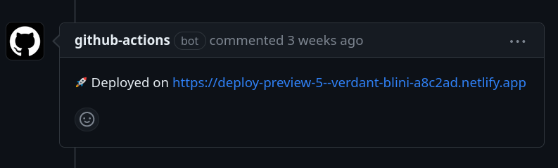

The purpose of this post is to review one solution to _"how do I provide automated
website previews for each Pull Request to my GitHub Pages repository?"_

Some services, like
[ReadTheDocs](https://docs.readthedocs.io/en/stable/pull-requests.html), provide this
workflow out-of-the-box to enable informed reviews to occur without needing to run any
command-line tooling. We used ReadTheDocs in my work on
[QGreenland](https://github.com/nsidc/qgreenland), and this workflow empowered people
who were not comfortable using Sphinx to meaningfully contribute to and review
documentation changes. My goal is to replicate that experience in GitHub Pages.


This post assumes you're using the "GitHub Actions" [deployment
method](https://docs.github.com/en/pages/getting-started-with-github-pages/configuring-a-publishing-source-for-your-github-pages-site),
not "Deploy from a branch". The latter has some [well-known pre-packaged
solutions](https://github.com/marketplace/actions/deploy-pr-preview), but the former
currently [doesn't](https://github.com/rossjrw/pr-preview-action/issues/21).

:::{.callout-note}
An update should go here when an out-of-the-box solution to this problem becomes
available.
:::

My requirements for solving this problem are:

1. **Free**: Some of my work is on open-source projects that won't ever bring in money.
2. **Integrates with GitHub**: I'd prefer for GitHub Pages to have full support for this
   out of the box. This is not currently the case
   ([yet](https://github.com/actions/deploy-pages/blob/main/action.yml#L28-L31)), so I
   need to compromise.
3. **Minimal/no permissions**: If I can't do this in GitHub's ecosystem, I don't want to
   grant any sort of third-party write permissions to my repository.


## 📖 GitHub Pages background

If you're familiar with GitHub Pages, you may want to [skip this
section](#sec-after-gh-pages-background).

GitHub provides many free features to open-source projects on its platform. This
includes GitHub Pages, a service for hosting "static" (HTML, CSS, Javascript) websites.
In combination with open-source software and other GitHub services, you can achieve
a comparable authoring experience to "dynamic" content management systems like
WordPress. In addition, you get the benefits of open collaboaration on GitHub.

 to
automatically run a [static site generator](https://jamstack.org/glossary/ssg/) to build
an HTML/CSS/JS website from content authored in
[Markdown](https://www.markdownguide.org/) in a GitHub
repository](github-pages-workflow.png){#fig-gh-pages-workflow}


### Why not "Deploy from a branch"?

"Deploy from a branch" requires a branch, typically named `gh-pages`, to contain the
final HTML/CSS/Javascript website content that will be hosted on GitHub Pages. I don't
like that option because I don't feel that non-source materials belong in my repository.
I would feel the same about including a compiled binary in my source repository; there
are better places for that to live.

Deploying with the "GitHub Actions" method enables me to deploy the output of my build
process by uploading it to GitHub as an "artifact". This atomic deployment method makes
pull request previews more challenging, but GitHub [is working on
it](https://github.com/actions/deploy-pages/pull/61).

Here's what a GitHub Actions configuration for this method might look like:

```yaml
name: "Build and deploy"

on:
  push:
    branches: ["main"]

permissions:
  contents: "read"
  pages: "write"
  id-token: "write"

jobs:
  build:
    runs-on: "ubuntu-latest"
    steps:
      - name: "Checkout"
        uses: "actions/checkout@v3"

      # ... build your site to e.g. `./_site`  ...

      - name: "Upload site artifact"
        uses: "actions/upload-pages-artifact@v1"
        with:
          path: "./_site"

  deploy:
    runs-on: "ubuntu-latest"
    needs: "build"
    environment:
      name: "github-pages"
      url: "${{ steps.deployment.outputs.page_url }}"
    steps:
      - name: "Deploy to GitHub Pages"
        id: "deployment"
        uses: "actions/deploy-pages@v1"
```

This only handles deployments to a live production site. Let's look at previews for Pull
Requests next.


## 🔍 Achieving Pull Request previews {#sec-after-gh-pages-background}

While GitHub Pages doesn't yet support Pull Request previews, I still want to use GitHub
Pages for my live site. The workflow shown in @fig-gh-pages-workflow will be used when
PRs are merged or when commits are pushed to the `main` branch.

For the PR previews, I'll temporarily use a third-party free service: Netlify.

{#fig-netlify-workflow}


### Why Netlify?

It was the first thing I tried 😁 Their free "starter" plan [has the features I
need](https://www.netlify.com/pricing/#pricing-table-full-feature-list) and doesn't
require me to provide a method of payment as of this writing.

[Vercel](https://vercel.com/) is a viable replacement. I'm sure there are others!
If you feel other services should be mentioned here, feel free to [open a pull
request](https://github.com/mfisher87/mfisher87.github.io/pulls).


### Netlify configuration {#sec-netlify-configuration}

To configure Netlify to host my Pull Request previews, I needed to go outside of their
"happy path" for setting up a new site. I think Netlify wants people to run their builds
on the Netlify build system, but I want to use GitHub Actions.

Since I only use Netlify to host PR previews, I can simply create a blank "Hello world"
site, and use [deploy previews](https://docs.netlify.com/site-deploys/deploy-previews/)
for PRs.

1. Log in with GitHub account, or any other method.
1. Skip any prompts to auto-configure a new site, and go to the Netlify dashboard. I
   don't want to allow Netlify to install a third-party GitHub app, because it requires
   too many permissions!
1. Create a new site "without connecting to Git":
    * Create a mock site, for example:

      ```bash
      mkdir /tmp/netlify-site
      echo "Hello world" > /tmp/netlify-site/index.html
      ```

    * In the Netlify dashboard, select the option to upload a folder:

      

    * Browse to and upload the mock site saved at `/tmp/netlify-site`.
    * Netlify will create a site with a name like
      [verdant-blini-a8c2ad](https://verdant-blini-a8c2ad.netlify.app).
1. Get the `Site ID` from the "Site configuration" menu, and save it as a [repo
   secret](https://docs.github.com/en/actions/security-guides/encrypted-secrets#creating-encrypted-secrets-for-a-repository)
   called `NETLIFY_SITE_ID`.
1. Generate a "Personal Access Token" in
   [user settings](https://app.netlify.com/user/applications#personal-access-tokens),
   and save it as a second repo secret called `NETLIFY_AUTH_TOKEN`.


### GitHub Actions configuration

I'm using [nwtgck/actions-netlify](https://github.com/nwtgck/actions-netlify) to push
the build as a [deploy preview](https://docs.netlify.com/site-deploys/deploy-previews/)
on Netlify.

The GitHub Action workflow requires an extra permission to add comments to PRs like the
one seen at the top of this post:

```yaml
permissions:
  pull-requests: "write"
```

Here's the configuration all together (and if you want, view my [live
implementation](https://github.com/mfisher87/mfisher87.github.io/blob/main/.github/workflows/deploy.yml)
which uses [Quarto](https://quarto.org) to build this website, or view the
[PR](https://github.com/mfisher87/mfisher87.github.io/pull/4) that introduced this
feature):


```yaml
# Build, and deploy to either GitHub Pages (production), or Netlify (PR previews)
name: "Build and deploy"

on:
  # "Production" deployments are from main branch
  push:
    branches: ["main"]

  # Preview deployments are from on PRs
  pull_request:


permissions:
  # For GitHub Pages:
  contents: "read"
  pages: "write"
  id-token: "write"
  # For PR preview comments:
  pull-requests: "write"


jobs:
  build:
    runs-on: "ubuntu-latest"
    steps:
      - name: "Checkout"
        uses: "actions/checkout@v3"

      # ... build your site to e.g. `./_site`  ...

      - name: "Upload site artifact"
        uses: "actions/upload-pages-artifact@v1"
        with:
          path: "./_site"


  # Deploy preview to Netlify IFF this action triggered by PR
  # Based on: https://github.com/quarto-dev/quarto-web/blob/main/.github/workflows/preview.yml
  deploy_preview:
    if: "github.event_name == 'pull_request'"
    runs-on: "ubuntu-latest"
    needs: "build"
    steps:
      - name: "Download site artifact"
        uses: "actions/download-artifact@v3"
        with:
          # The name of artifacts created by `actions/upload-pages-artifact` is always "github-pages"
          name: "github-pages"
          path: "./_site"

      - name: "Untar site artifact"
        run: "tar --directory ./_site -xvf ./_site/artifact.tar "

      - name: "Deploy preview to Netlify"
        uses: "nwtgck/actions-netlify@v2"
        env:
          NETLIFY_SITE_ID: "${{ secrets.NETLIFY_SITE_ID }}"
          NETLIFY_AUTH_TOKEN: "${{ secrets.NETLIFY_AUTH_TOKEN }}"
        with:
          publish-dir: "./_site"
          production-deploy: false
          github-token: "${{ secrets.GITHUB_TOKEN }}"
          deploy-message: "Deploy from GHA: ${{ github.event.pull_request.title }}"
          alias: "pr-${{ github.event.pull_request.number }}-preview"
          # these all default to 'true'
          enable-pull-request-comment: true
          enable-commit-comment: false
          enable-commit-status: true
          overwrites-pull-request-comment: false
        timeout-minutes: 1


  # Deploy to GH Pages IFF this action triggered by push
  deploy:
    if: "github.event_name == 'push'"
    runs-on: "ubuntu-latest"
    needs: "build"
    environment:
      name: "github-pages"
      url: "${{ steps.deployment.outputs.page_url }}"
    steps:
      - name: "Deploy to GitHub Pages"
        id: "deployment"
        uses: "actions/deploy-pages@v1"
```


### How does this work for open-source teams?

This setup relies on an individual's Netlify account. This is because Netlify starts to
ask for money for team features.

_What happens if the person with the Netlify account disappears from the project?_

As long as you have other repository admins, or can fork the repository to a new home,
you can always have another individual repeat the [Netlify configuration
steps](#sec-netlify-configuration) and replace the `NETLIFY_SITE_ID` and
`NETLIFY_AUTH_TOKEN` repository secrets with their own.

I hope to only use this solution as a temporary stop-gap until GitHub Pages can more
properly support this need.


### Going further

I think this pattern could be used to deploy PR previews for multiple GitHub
repositories on the same Netlify "site" by including the repo name in the `alias` option
to the `nwtgck/actions-netlify` action. I haven't tried it, but maybe it looks like:

```yaml
alias: "${{github.event.repository.name}}-pr-${{ github.event.pull_request.number}}-preview"
```


## 🏆 Acknowledgements

* Thanks to reviewers: [Wei Ji](https://github.com/weiji14), [Robin
  Fisher](https://github.com/itsarobin)
* Thanks to developers of the actions I relied on.
* This configuration was based on the [Quarto
  website](https://github.com/quarto-dev/quarto-web/blob/main/.github/workflows/preview.yml) project.
